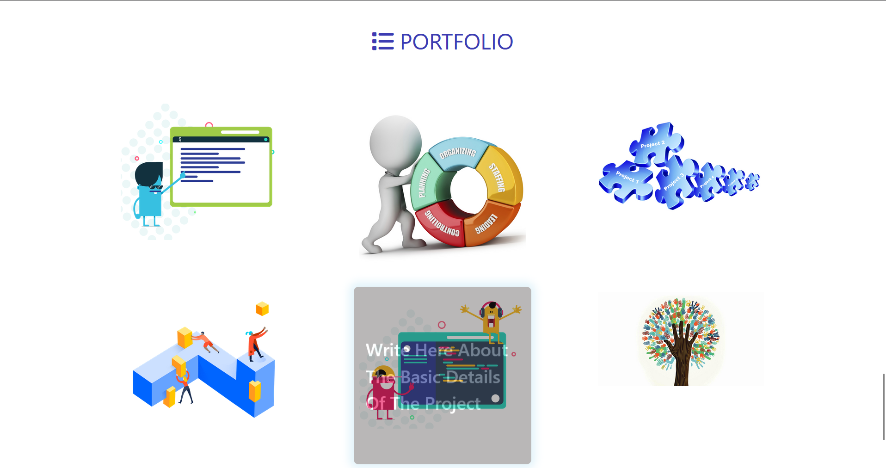

# Resume Capstone Project

This is a responsive resume website built using **HTML, CSS, and Bootstrap**. The project showcases a professional resume with sections for personal details, skills, experience, education, and contact information.

## Output

## 🔗 Live Demo
[Resume Capstone Project](https://resume-project-html-css-bootstrap.netlify.app/)

## 📌 Features
- Fully responsive design using **Bootstrap**
- Clean and modern UI
- Interactive contact form
- Smooth scrolling and navigation
- Social media links integration

## 🛠️ Technologies Used
- **HTML5**  
- **CSS3**  
- **Bootstrap 5**  